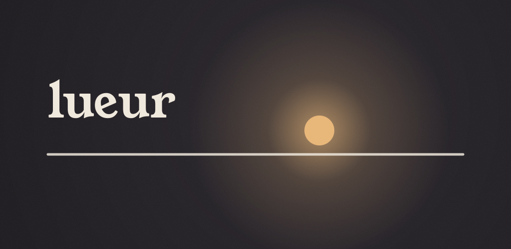

<p align="center">
  
</p>

<p align="center"><strong>A sleep diary, simple and private.</strong><br/>
iOS · Android · open source (MIT) · 100 % local · no account · nothing to pay</p>

<p align="center"><a href="README.fr.md">Version française</a></p>

---

Lueur was born from a real problem: nights broken by noise (a mosquito, the neighbours), by thoughts, by watching the clock tick — and no way of knowing **how often** it happens and **since when**.

Each morning you note your night in about fifteen seconds. Over the weeks, the difficult nights become visible: how many, when, and what tends to come with them. Nothing more, nothing less.

<p align="center">
  
  
  
  
</p>

## What it does

- **Morning entry in ~15 seconds**, pre-filled from your usual hours or the previous night. You drag the points of the night band itself: bedtime, asleep, woke up, got up. Tap the band to add an awakening. Five drawn levels of how the night felt (no stars, no faces), markers (noise, insect, thoughts, clock-watching, caffeine…), an optional note. Forgotten nights can be caught up for 14 days.
- **Difficult nights, without digging**: "10 difficult nights in the last 30 days — the month before: 14". A night is difficult if it felt rough, took more than 30 min to fall asleep, or had more than 30 min awake.
- **The month as a weave**: each night is a horizontal band of light on a shared 6 pm → 2 pm axis. Length is time in bed, dark gaps are awakenings, brightness is how it felt.
- **Patterns**: estimated sleep, time in bed, efficiency, time to fall asleep, awakenings, regularity; **tag correlations** shown only with enough nights and careful wording ("a link, not necessarily a cause"); **bedtime drift** detection; **weekday/weekend gap**; an **environment journal** comparing the two weeks before and after a change (fan, mosquito net, earplugs…).
- **"I can't sleep" mode**: a nearly black screen, dimmed brightness, **no clock**, a glow that breathes with you, and the 20-minute rule as a gentle, invisible suggestion. The awakening is noted for the next morning.
- **Local reminders only**: one morning reminder (skipped if the night is already logged, and Lueur stops asking after 14 days without opening the app), an optional evening wind-down cue.
- **Your data**: JSON backup and restore ([documented format](docs/DATA_FORMAT.md)), CSV, a **PDF sleep diary for your doctor** (2–4 weeks), erase everything in one gesture.
- French and English, morning and night ambiances that follow the time of day, VoiceOver/TalkBack, Dynamic Type, 44 pt touch targets.

## Philosophy

- **Nothing leaves the phone.** No server, no account, no analytics, no crash reporting, no ads. The Android release build does not even have the `INTERNET` permission; CI fails if a network API appears in the sources.
- **No added anxiety.** No score out of 100, no streak to break, no badges. Calm, adult wording: "Short night. It happens."
- **Not a medical device.** Lueur is inspired by the sleep diary used in CBT-I but does not diagnose anything and does not replace a professional. If difficult nights go on, the PDF export is made to help that conversation.

## Design

The light of a night-light in a dark room: a small warm source, diffuse glow, a light film grain. The app follows the time of day — *dawn on paper* in the morning, *ink* with a single amber glow at night. Typefaces: Young Serif and Ysabeau Office (SIL OFL), bundled. Everything is specified in [`docs/DESIGN.md`](docs/DESIGN.md).

## Build it yourself

No Expo cloud service is involved: everything builds locally.

```bash
npm ci
npm run check          # typecheck + lint + unit tests
npm run android        # debug build on an emulator/device (needs Android SDK + JDK 21)
npm run ios            # debug build on the iOS simulator (macOS + Xcode)
npm run e2e            # Maestro journeys (emulator running, app installed)
```

Release builds, signing and store uploads use **fastlane** locally or in **GitHub Actions**:

```bash
bundle install
bundle exec fastlane android build   # signed AAB, verifies no INTERNET permission
bundle exec fastlane ios build       # signed IPA (macOS)
```

The whole procedure, including the credentials you need, is in [`docs/RELEASE.md`](docs/RELEASE.md).

| | |
|---|---|
| Stack | Expo SDK 57 (CNG), React Native 0.86, TypeScript strict, expo-router, expo-sqlite + drizzle, zustand, Reanimated 4, Skia |
| Architecture | [`docs/PLAN.md`](docs/PLAN.md) — pure, tested domain logic in `src/domain/` |
| Decisions | [`docs/DECISIONS.md`](docs/DECISIONS.md) |
| Roadmap | [`docs/ROADMAP.md`](docs/ROADMAP.md) — local MCP server, widgets, Health integrations |
| Stores | [`docs/STORE.md`](docs/STORE.md), [`fastlane/metadata/`](fastlane/metadata) |
| Privacy | [`site/privacy.html`](site/privacy.html) |

## Contributing

Contributions are welcome: see [CONTRIBUTING.md](CONTRIBUTING.md). Please keep the principles above — especially "nothing leaves the phone" and the tone.

## Licence

[MIT](LICENSE). Fonts under the SIL Open Font License 1.1 (`assets/fonts/`).
